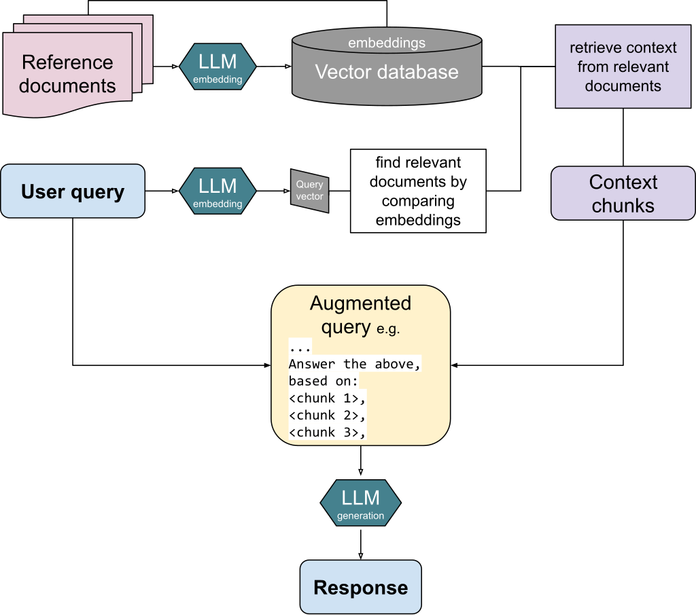

# Ragger
## Description
[RAG](https://en.wikipedia.org/wiki/Retrieval-augmented_generation) stands for Retrieval-Augmented Generation. It helps large language model (LLM) to answer questions with reference to specific documents.
In this RAG system, it contains following parts
- Chunking: Divide documents to small parts
- Embedding: Give each chunk a vector to represent the content
- Retrieving: Given a question, embed the question, find the chunk with the closest vector distance
- Augmenting: Send the question and the closest chunk to LLM
- Generation: LLM generate the answer based on the context

## Components
Llama-index is used to build the RAG system and orchestrate everything. Jina-index is used for embedding document in german. GPT3-turbo (fee required) and Llama3 (free) are used for LLM. Frontend is built by html/css/javascript. Backend is built by Flask. Frontend is built by React.
## Features
A JavaScript library pdf-worker is used to show the document with marked chunk side by side for the user to proof the authenticity of the answer.
## Installation
Clone the repository
```
git clone git@github.com:limlleonard/ragger_react.git
```
Change Directory to Scripts
```
cd ragger_react
```
Create and activate a virtual environment (recommanded)
```
python -m venv venv_rag
source venv_rag/bin/activate # macOS/linux
venv_rag\Scripts\Activate # PowerShell
```
Install requirements
```
pip install -r requirements.txt
```
Start the programm
```
python ./backend/app.py
```

Ctrl + click on the provided link or open a browser and type in: http://127.0.0.1:5000/